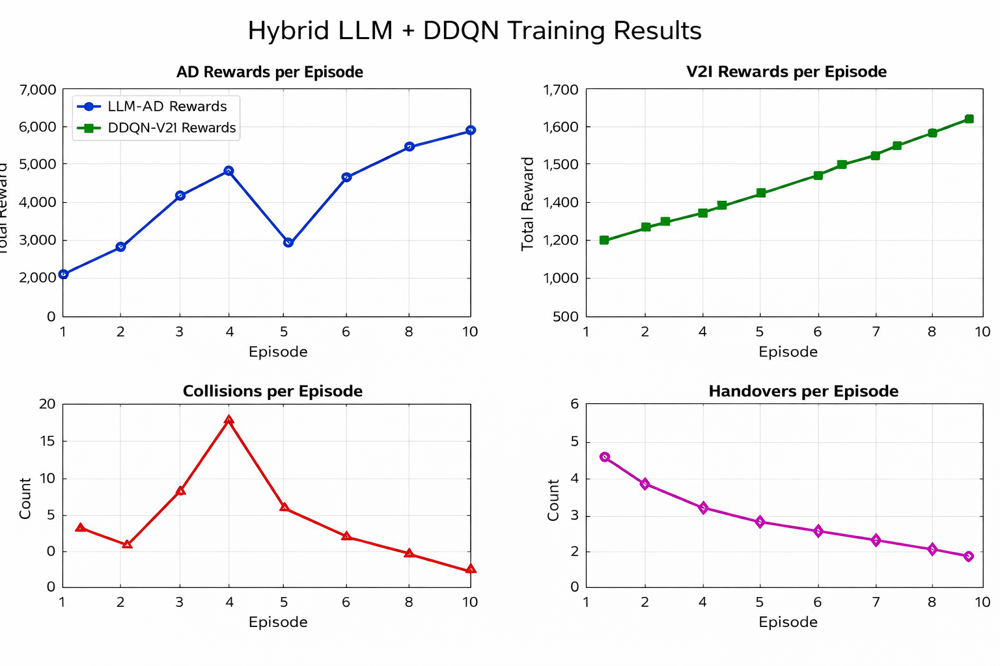
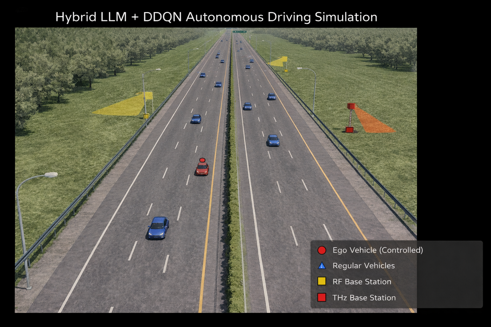

# Hybrid LLM + DDQN for Autonomous Driving and V2I Communication

## Overview

This project presents a **Hybrid AI framework** that integrates:

* **Large Language Model (LLM)** for autonomous driving decision-making
* **Double Deep Q-Network (DDQN)** for Vehicle-to-Infrastructure (V2I) communication optimization

The system is implemented and evaluated using the **SUMO (Simulation of Urban Mobility)** environment.

---

## Key Contributions

* Hybrid integration of **LLM-based reasoning** with **reinforcement learning**
* Real-time decision-making for:

  * Vehicle control (speed & lane changes)
  * Base station selection (RF / THz)
* Custom **reward functions** for driving safety and communication efficiency
* Experience-based prompting using **retrieval from past trajectories**

---

## System Architecture

### Autonomous Driving (LLM)

* Uses **Llama 3.1 (8B)** via Ollama
* Takes environment state as input
* Generates driving actions:

  * FASTER
  * SLOWER
  * LANE_LEFT
  * LANE_RIGHT
  * IDLE

### V2I Communication (DDQN)

* State:

  * Reachable RF base stations
  * Reachable THz base stations
  * Current driving action
* Actions:

  * Stay connected
  * Switch RF
  * Switch THz

---

## Environment Setup

* Simulator: **SUMO**
* Road: 4-lane highway (3 km)
* Traffic:

  * One ego vehicle (controlled)
  * Multiple background vehicles
* Communication:

  * RF Base Stations (long-range)
  * THz Base Stations (short-range, high capacity)

---

## Reward Design

### Autonomous Driving Reward

* Speed maximization
* Collision penalty
* Lane preference
* On-road constraint

### V2I Reward

* Connectivity maintenance
* Handover penalty
* Base station availability bonus

---

## Training Details

* Episodes: 10
* Steps per episode: 1000
* LLM query interval: every 50 steps
* DDQN:

  * Replay buffer
  * Target network updates
  * Epsilon-greedy exploration

---

## Results

The following figure shows the **expected learning behavior** of the hybrid system:

* Increasing **Autonomous Driving rewards**
* Stable and improving **V2I rewards**
* Decreasing **collisions**
* Optimized **handover decisions**

### 📊 Training Results




---

## Project Structure

```
├── src/
│   ├── agents/
│   │   ├── llm_agent.py
│   │   ├── ddqn_agent.py
│   ├── environment/
│   │   └── sumo_env.py
│   ├── utils/
│   │   ├── reward_functions.py
│   │   ├── experience_buffer.py
│   │   ├── prompts.py
│
├── sumo_scenarios/
├── results/
│   └── training_summary.png
├── main.py
├── test_*.py
└── requirements.txt
```

---

## How to Run

### 1. Install Dependencies

```bash
pip install -r requirements.txt
```

### 2. Setup SUMO

* Install SUMO
* Set environment variable:

```bash
export SUMO_HOME=/path/to/sumo
```

(Windows)

```bash
setx SUMO_HOME "C:\Path\To\SUMO"
```

---

### 3. Run Training

```bash
python main.py
```

---

## Dependencies

* Python 3.x
* PyTorch
* SUMO + TraCI
* Ollama (for LLM inference)
* NumPy, Matplotlib

---

## Applications

* Autonomous driving systems
* Intelligent transportation systems (ITS)
* 6G-enabled vehicular communication
* Smart mobility infrastructure

---

## Team Contribution

This is a **collaborative group project**, where contributions include:

* LLM-based driving strategy design
* Reinforcement learning model development
* Simulation and environment setup
* Result analysis and visualization

---

## Conclusion

This work demonstrates that combining **LLM reasoning** with **reinforcement learning optimization** enables effective joint decision-making for both:

* Autonomous driving
* Communication resource allocation

This approach provides a foundation for future **AI-driven intelligent transportation systems**.

---
